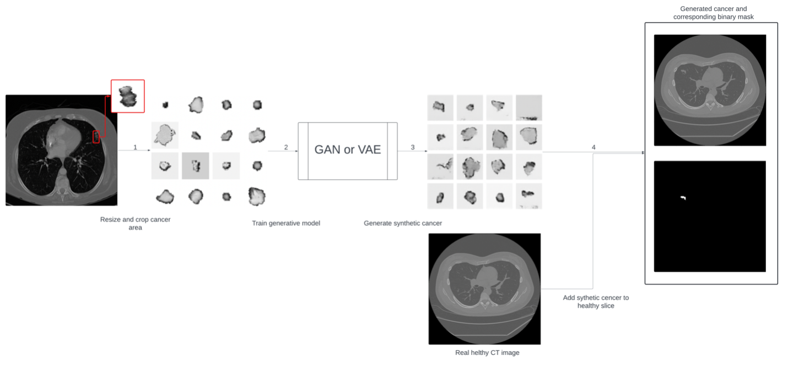

# Multiparameter-models-for-lung-cancer-data-augmentation

This repository contains code for data augmentation based on multiparametric models, specifically DCGAN [1] and VQVAE [2], applied to lung cancer diagnosis. The augmentation process follows the pipeline illustrated in Figure 1.

## Dataset 

The real data used for training the augmentation models, as well as for the baseline models, are available at [3]. The lung cancer segmentation dataset comprises CT images paired with corresponding lung cancer masks, meticulously labeled by radiologists according to the Lung-RADS System. This dataset is a fusion of original Kazakhstani local data from the Kazakh Research Institute of Oncology and Radiology, and the openly available LIDC-IDRI dataset [4], which has been re-labeled. The entire dataset has been divided into training and testing sets, with the training set consisting of 708 CT images and the test set containing 264 CT images. All images share a standardized labeling format: 
<ul>
  <li>label1 – class according to Lung-RADS System</li>
  <li>mask – binary mask of lung cancer area</li>
  <li>hu_array_old – CT image converted standardized in Hounsfield Units</li>
  <li>hu_array – CT image with dropped non-lung area via thresholding-based algorithm</li>
</ul>

## VQVAE 

The Vector Quantized Variational Autoencoder (VQVAE) [2] is a generative model that uses discrete latent representations to learn high-quality, compressed data encodings, making it particularly effective for image data augmentation in diagnostic tasks. Our implementation is based on code from the following sources:

- [VQVAE Implementation by Misha Laskin](https://github.com/MishaLaskin/vqvae/tree/master)
- [PyTorch VQVAE by Zalando Research](https://github.com/zalandoresearch/pytorch-vq-vae/blob/master/vq-vae.ipynb)

Code implementation of VQVAE could be available by the links:
- [Application of VQVAE for new cancer areas (RoI) generation](https://github.com/namdiana/Multiparameter-models-for-lung-cancer-data-augmentation/blob/main/VQVAE/VQVAE.ipynb) 

Generated cancer areas (RoI) by VQVAE could be available via [https://drive.google.com/file/d/1qbetzi17qRLZVlcdogIPji8Db2JxmTs8/view?usp=drive_link]

Generated dataset received by adding cancer areas to healthy CT images [https://drive.google.com/file/d/1XYxOn1BSTaMDdFLYI92zfqO6WDs2b8nU/view?usp=drive_link]

## DCGAN

The Deep Convolutional Generative Adversarial Network (DCGAN) [1] is a type of GAN that leverages convolutional layers to generate realistic image data by training a generator to create images that can fool a discriminator. DCGAN is widely used for tasks requiring synthetic data generation due to its stability and high-quality outputs in image synthesis.

### References:

[1] Radford, A., Metz, L., & Chintala, S. (2015). Unsupervised representation learning with deep convolutional generative adversarial networks. arXiv preprint arXiv:1511.06434.

[2] Van den Oord, A., Vinyals, O., & Kavukcuoglu, K. (2017). Neural discrete representation learning. arXiv preprint arXiv:1711.00937. 

[3] Nam, Diana; Panina, Alexandra; Pak, Alexandr (2024), “Lung cancer segmentation dataset with Lung-RADS class”, Mendeley Data, V1, doi: 10.17632/5rr22hgzwr.1

[4] Armato III, S. G., McLennan, G., Bidaut, L., McNitt-Gray, M. F., Meyer, C. R., Reeves, A. P., Zhao, B., Aberle, D. R., Henschke, C. I., Hoffman, E. A., Kazerooni, E. A., MacMahon, H., Van Beek, E. J. R., Yankelevitz, D., Biancardi, A. M., Bland, P. H., Brown, M. S., Engelmann, R. M., Laderach, G. E., Max, D., Pais, R. C. , Qing, D. P. Y. , Roberts, R. Y., Smith, A. R., Starkey, A., Batra, P., Caligiuri, P., Farooqi, A., Gladish, G. W., Jude, C. M., Munden, R. F., Petkovska, I., Quint, L. E., Schwartz, L. H., Sundaram, B., Dodd, L. E., Fenimore, C., Gur, D., Petrick, N., Freymann, J., Kirby, J., Hughes, B., Casteele, A. V., Gupte, S., Sallam, M., Heath, M. D., Kuhn, M. H., Dharaiya, E., Burns, R., Fryd, D. S., Salganicoff, M., Anand, V., Shreter, U., Vastagh, S., Croft, B. Y., Clarke, L. P. (2015). Data From LIDC-IDRI [Data set]. The Cancer Imaging Archive, doi: https://doi.org/10.7937/K9/TCIA.2015.LO9QL9SX
